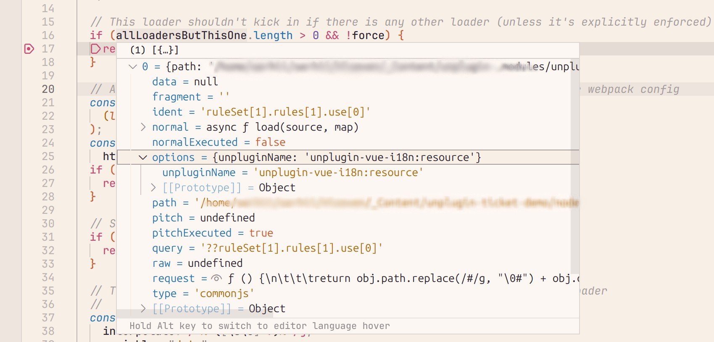
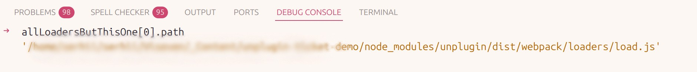
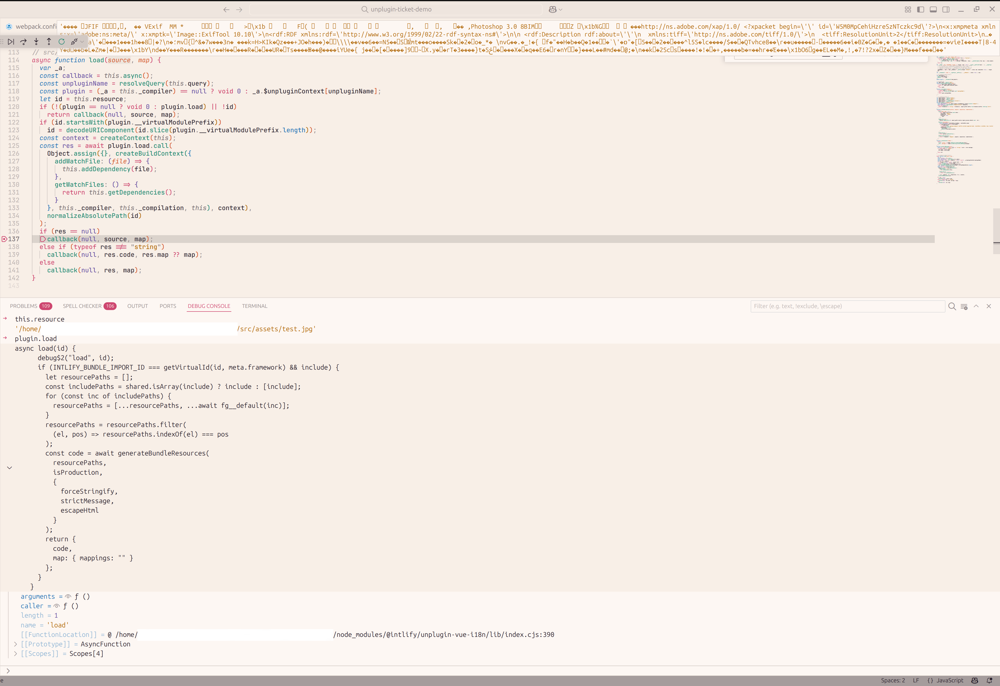

# Project demonstrating Vue 3 + vue-i18n bundling issues with webpack 5

This project was created using the base [Vue CLI](https://cli.vuejs.org/) template.
The project bundling is implemented with webpack 5 to demonstrate real-world issues that occur in production solutions that are also built with webpack.
To build the project, run the npm script named `build:webpack`.
The build script will execute build.js, which uses the webpack API to bundle the test content.
The build uses a minimal webpack.config.js configuration.

At the time of creating this project, the latest version of `@intlify/unplugin-vue-i18n` is 6.0.8, which uses `unplugin@1.16.1`.
```
> npm ls unplugin
└─┬ @intlify/unplugin-vue-i18n@6.0.8
  └── unplugin@1.16.1
```

### Project setup
```
npm ci
```

### Compiles for production
```
npm run build:webpack
```

The key feature of this project is the use of i18n in Vue.js 3 based project and the accompanying ecosystem of plugins/loaders for webpack 5.
Two issues have been identified related to unplugin usage.

## Issue #1: html-webpack-plugin compatibility

When using `@intlify/unplugin-vue-i18n` together with `html-webpack-plugin` in webpack configuration, the compilation fails with the following error:

```
Error: Child compilation failed:
  Module parse failed: Unexpected token (1:0)
  File was processed with these loaders:
   * ./node_modules/unplugin/dist/webpack/loaders/load.js
   * ./node_modules/html-webpack-plugin/lib/loader.js
  You may need an additional loader to handle the result of these loaders.
  > <!DOCTYPE html>
  ...
```

This error indicates that webpack doesn't know how to process the `.html` file.
The `html-webpack-plugin` was added to `webpack.config.js` specifically to handle `.html` files.

During compilation, the loader provided by `html-webpack-plugin` (`html-webpack-plugin/lib/loader.js`) checks for the presence of other loaders that have processed the .html file before handling it itself.

This occurs in the following code block:

```javascript
if (allLoadersButThisOne.length > 0 && !force) {
  return source;
}
```

Original code: https://github.com/jantimon/html-webpack-plugin/blob/v5.6.3/lib/loader.js#L16

If other loaders are present, `html-webpack-plugin` doesn't modify the `.html` file and simply returns its source as-is.
When debugging at this point, you can observe the following:




This shows that unplugin has already invoked its loader for the .html file and not only failed to process it itself, but also prevented `html-webpack-plugin` from processing it.

## Issue #2: Binary file corruption

When using `@intlify/unplugin-vue-i18n`, unplugin corrupts all binary files (e.g., .jpg, .png, .svg) in the project, which then cannot be used in Vue components.

The root cause is `unplugin/dist/webpack/loaders/load.js`, which during execution calls the loader from `@intlify/unplugin-vue-i18n`. This loader does nothing with the source of these files (since the loader's condition check doesn't match). Subsequently, unplugin/dist/webpack/loaders/load checks the result of the unplugin-vue-i18n loader execution, which is undefined, and unplugin/dist/webpack/loaders/load calls the callback with the original input source.



Original code: https://github.com/unjs/unplugin/blob/v1.16.1/src/webpack/loaders/load.ts

Since unplugin/dist/webpack/loaders/load lacks the `raw = true` variable, webpack treats the source as regular text content and attempts to process it as text rather than binary data.

This results in corruption of all binary files, leading to broken image and font files that cannot be used.

**Note:** This issue appears to be relevant for both unplugin@1.x.x and unplugin@2.x.x, as both major versions lack this variable.